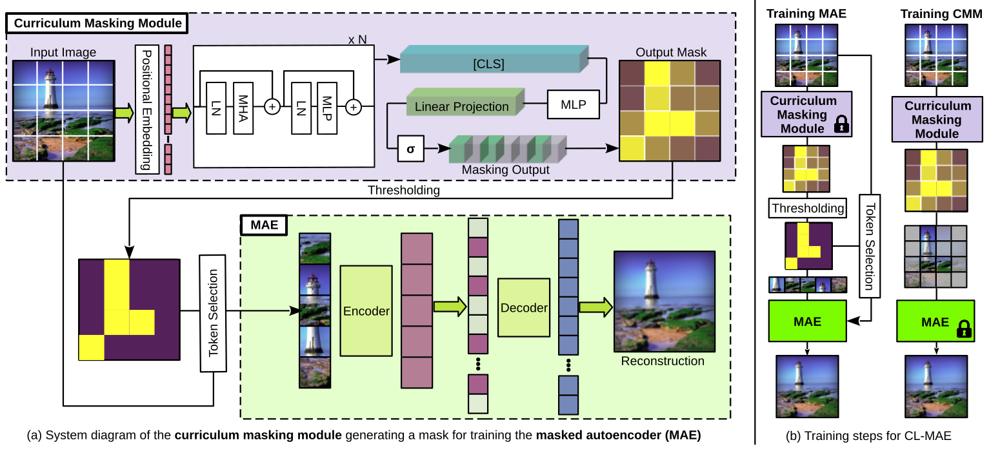

# CL-MAE: Curriculum-Learned Masked Autoencoders [WACV 2023]

## Abstract
Masked image modeling has been demonstrated as a powerful pretext task for generating robust representations that can be effectively generalized across multiple downstream tasks. Typically, this approach involves randomly masking patches (tokens) in input images, with the masking strategy remaining unchanged during training. In this paper, we propose a curriculum learning approach that updates the masking strategy to continually increase the complexity of the self-supervised reconstruction task. We conjecture that, by gradually increasing the task complexity, the model can learn more sophisticated and transferable representations. To facilitate this, we introduce a novel learnable masking module that possesses the capability to generate masks of different complexities, and integrate the proposed module into masked autoencoders (MAE). Our module is jointly trained with the MAE, while adjusting its behavior during training, transitioning from a partner to the MAE (optimizing the same reconstruction loss) to an adversary (optimizing the opposite loss), while passing through a neutral state. The transition between these behaviors is smooth, being regulated by a factor that is multiplied with the reconstruction loss of the masking module. The resulting training procedure generates an easy-to-hard curriculum. We train our Curriculum-Learned Masked Autoencoder (CL-MAE) on ImageNet and show that it exhibits superior representation learning capabilities compared to MAE. The empirical results on five downstream tasks confirm our conjecture, demonstrating that curriculum learning can be successfully used to self-supervise masked autoencoders.

<p align="center">

</p>

### Citation
If this work is useful for your research, please cite our paper.

```bibtex
@InProceedings{cl-mae_2024_wacv,
  title={CL-MAE: Curriculum-Learned Masked Autoencoders},
  author={Madan, Neelu and Ristea, Nicolae-Catalin and Nasrollahi, Kamal and Moeslund, Thomas B and Ionescu, Radu Tudor},
  booktitle={Proceedings of WACV},
  year={2024}
}
```
